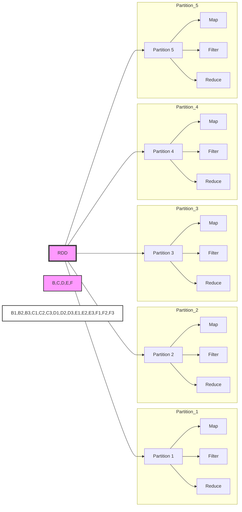
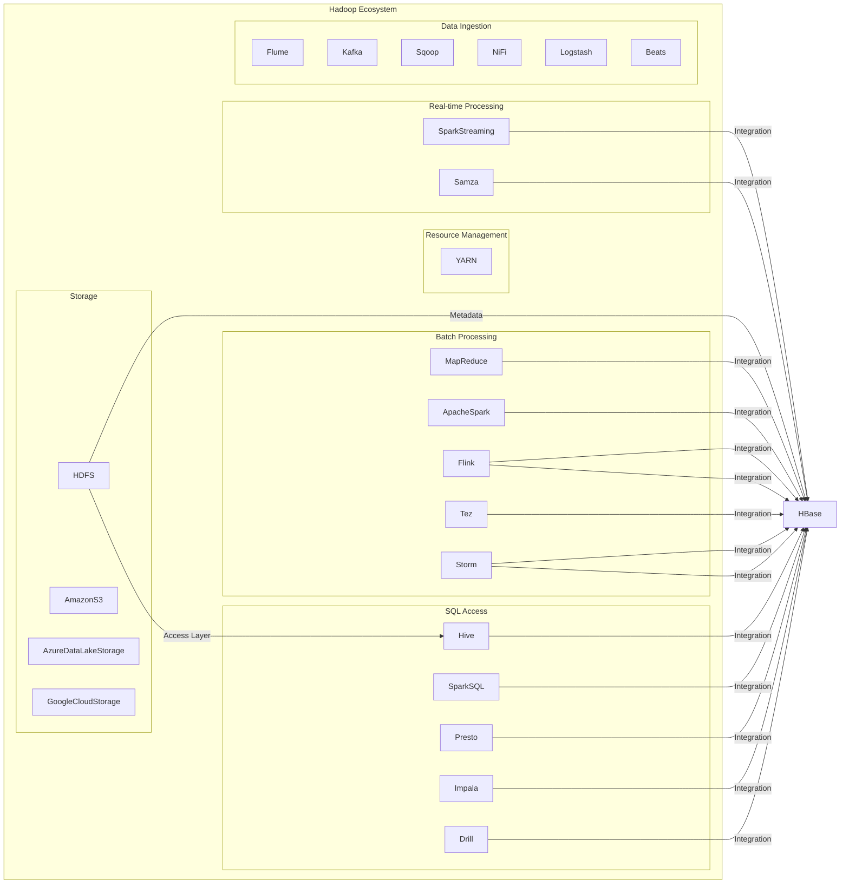

<div align="center">
  
</div>

## Basics of RDD Programming

### Creating RDDs

1. Loading data from a file system
2. Using parallelized collections (arrays)

**Loading data from a file system**

In Spark, `SparkContext` uses the `.textFile()` method to read data and create an RDD in memory. The `.textFile()` method supports various file systems, including:

- Local file system
- HDFS
- S3, among others

```python
# For a local file, make sure to use "file:///"
lines = sc.textFile("file:///usr/local/spark/example.txt")

# The following three statements are completely equivalent
lines = sc.textFile("hdfs://localhost:9000/user/hadoop/example.txt")
lines = sc.textFile("/user/hadoop/example.txt")
lines = sc.textFile("example.txt")

lines.foreach(print)
```

**Using parallelized collections (arrays)**

You can also create an RDD by parallelizing an existing collection (such as an array) using the `sc.parallelize()` method of the `SparkContext` object.

```python
array = [1, 2, 3, 4, 5]
rdd = sc.parallelize(array)
rdd.foreach(print)
```

### RDD Operations

#### Transformation

RDD transformations are operations that produce a new RDD from an existing one. Transformations are lazy, meaning they are not executed immediately but are instead recorded in a lineage graph, allowing Spark to optimize their execution.

Here's an example of using transformations and then we will deep dive into each of the RDD transformations

```python
# Transformation: map() squares each number
squared_rdd = rdd.map(lambda x: x * x)

# Transformation: filter() keeps only even numbers
even_rdd = rdd.filter(lambda x: x % 2 == 0)
```

---

##### `filter(func)`

Applies a function to each element of the RDD and returns a new RDD with only the elements that satisfy the condition.

```python
>>> lines = sc.textFile("file:///usr/local/spark/mycode/rdd/word.txt")
>>> linesWithSpark = lines.filter(lambda line: "Spark" in line)
>>> linesWithSpark.foreach(print)
Spark is better
Spark is fast
```


---

##### `map(func)`

Applies a function to each element of the RDD and returns a new RDD with the results.

```python
>>> lines = sc.textFile("file:///usr/local/spark/mycode/rdd/word.txt")
>>> words = lines.map(lambda line:line.split(" "))
>>> words.foreach(print)
['Hadoop', 'is', 'good']
['Spark', 'is', 'fast']
['Spark', 'is', 'better']
```


---

##### `flatMap(func)`

Similar to `map()`, but each input item can be mapped to 0 or more output items.

```python
>>> lines = sc.textFile("file:///usr/local/spark/mycode/rdd/word.txt")
>>> words = lines.flatMap(lambda line:line.split(" "))
```


---

##### `groupByKey()`

Groups the values of each key into an iterable.

```python
>>> words = sc.parallelize([("Hadoop",1),("is",1),("good",1), \
... ("Spark",1),("is",1),("fast",1),("Spark",1),("is",1),("better",1)])
>>> words1 = words.groupByKey()
>>> words1.foreach(print)
('Hadoop', <pyspark.resultiterable.ResultIterable object at 0x7fb210552c88>)
('better', <pyspark.resultiterable.ResultIterable object at 0x7fb210552e80>)
('fast', <pyspark.resultiterable.ResultIterable object at 0x7fb210552c88>)
('good', <pyspark.resultiterable.ResultIterable object at 0x7fb210552c88>)
('Spark', <pyspark.resultiterable.ResultIterable object at 0x7fb210552f98>)
('is', <pyspark.resultiterable.ResultIterable object at 0x7fb210552e10>)
```


---

##### `reduceByKey(func)`

Aggregates the values of each key using a specified function.

```python
>>> words = sc.parallelize([("Hadoop",1),("is",1),("good",1),("Spark",1), \
... ("is",1),("fast",1),("Spark",1),("is",1),("better",1)])
>>> words1 = words.reduceByKey(lambda a,b:a+b)
>>> words1.foreach(print)
('good', 1)
('Hadoop', 1)
('better', 1)
('Spark', 2)
('fast', 1)
('is', 3)
```


Transformations allow you to build complex processing pipelines by chaining multiple operations together. These pipelines are executed lazily, enabling Spark to optimize their execution plan for performance.In the next section, we'll explore RDD actions, which trigger the execution of transformations and return results to the driver program.

#### Action

RDD actions are operations that trigger the execution of transformations and return results to the driver program or write data to an external storage system. Unlike transformations, actions are eagerly executed and may trigger the execution of multiple transformations in the RDD lineage graph.

Common RDD actions include:

- `collect()`: Retrieves all elements of the RDD and returns them to the driver program as a local collection.
- `count()`: Counts the number of elements in the RDD.
- `take(n)`: Retrieves the first `n` elements of the RDD and returns them to the driver program as a local collection.
- `reduce(func)`: Aggregates the elements of the RDD using a specified function.

Here's an example of using actions:

```python
# Action: collect() retrieves all elements
all_elements = rdd.collect()

# Action: count() counts the number of elements
num_elements = rdd.count()

# Action: take() retrieves the first 5 elements
first_elements = rdd.take(5)

# Action: reduce() aggregates elements by summing them
total_sum = rdd.reduce(lambda x, y: x + y)
```

Actions are typically used to extract results from RDDs and perform final computations. However, it's essential to use actions judiciously, especially when dealing with large datasets, as they may trigger costly computations across a distributed cluster.

#### Lazy Evaluation

The term "lazy evaluation" refers to the mechanism where the entire transformation process only records the trajectory of transformations without actually computing anything. Only when an action operation is encountered will the real computation occur "from start to finish." Here is a simple statement to explain Spark's lazy evaluation mechanism.

```python
>>> lines = sc.textFile("file:///usr/local/spark/mycode/rdd/word.txt")
>>> lineLengths = lines.map(lambda s:len(s))
>>> totalLength = lineLengths.reduce(lambda a,b:a+b) # 程序真正执行
>>> print(totalLength)
```

### Persistence

In Spark, RDDs adopt a lazy evaluation mechanism, which means that each time an action operation is encountered, computation starts from scratch. Every time an action operation is called, it triggers a computation starting from scratch. This incurs significant costs for iterative computations, as iterative computations often require repeatedly using the same set of data.

```python
list = ["Hadoop","Spark","Hive"]
rdd = sc.parallelize(list)

print(rdd.count()) # Action, triggers a computation from start to finish
3

print(','.join(rdd.collect())) # Action, triggers a computation from start to finish
Hadoop,Spark,Hive
```

So, to avoid the overhead of such repeated computations, you can use the persistence (caching) mechanism. You can mark an RDD as persistent using the `persist()` method.

- It's called "marking as persistent" because when the `persist()` statement appears, it doesn't immediately compute and cache the RDD. Instead, it waits until the first action operation triggers the actual computation, and then it caches the result.
- Once persisted, the RDD will be kept in memory on the compute nodes for reuse by subsequent action operations.

#### `persist()`

- `persist(MEMORY_ONLY)`: Represents storing the RDD as deserialized objects in the JVM. If memory is insufficient, it will evict cache contents based on the Least Recently Used (LRU) principle. The `rdd.cache()` method invokes this API.
- `persist(MEMORY_AND_DISK)`: Represents storing the RDD as deserialized objects in the JVM. If memory is insufficient, partitions exceeding the memory limit will be stored on disk.

Generally, when using the `.cache()` method, `persist(MEMORY_ONLY)` is invoked.

You can use the `.unpersist()` method to manually remove a persisted RDD from the cache.

```python
lst = ["Hadoop", "Spark", "Hive"]
rdd = sc.parallelize(lst)

rdd.cache()  # Invokes persist(MEMORY_ONLY). However, at this point, rdd is not cached because it has not been computed yet.

print(rdd.count())  # The first action operation triggers a computation from start to finish. At this point, rdd.cache() is executed, caching the rdd.

print(','.join(rdd.collect()))  # The second action operation. No need to trigger a computation from start to finish. It just reuses the rdd cached above.
```

### Partitions

RDDs are Resilient Distributed Datasets. Typically, RDDs are large and are divided into many partitions, which are stored on different nodes.

**Purpose of Partitions**

**1. Increasing Parallelism**



<!--  -->

**2. Reducing Communication Overhead**

#### RDD Partitioning Principle

One principle of RDD partitioning is to **make the number of partitions roughly equal to the number of CPU cores in the cluster**.

For different Spark deployment modes (local mode, Standalone mode, YARN mode, Mesos mode), you can configure the default number of partitions by setting the `spark.default.parallelism` parameter. Generally:

- Local mode: Default is the number of CPU cores on the local machine. If `local[N]` is set, the default is `N`.
- Apache Mesos: Default number of partitions is `8`.
- Standalone or YARN: The default value is the maximum of the "**total number of CPU cores in the cluster**" and "2".

---

**Setting the Number of Partitions**

**1. Manually Specifying the Number of Partitions**

You can manually specify the number of partitions when calling the `.textFile()` and `.parallelize()` methods. The syntax is as follows:

```python
sc.textFile(path, partitionNum)
```

Where the path parameter specifies the address of the file to load, and the partitionNum parameter specifies the number of partitions.

```python
>>> list = [1,2,3,4,5]
>>> rdd = sc.parallelize(list,2) # Set two partitions
```

**2. Modifying the Number of Partitions Using the repartition Method**

When acquiring a new RDD through transformation operations, you can simply utilize the `.repartition()` method. For example:

```python
data = sc.parallelize([1, 2, 3, 4, 5], 2)

len(data.glom().collect())  # Displays the number of partitions of the data RDD
2

rdd = data.repartition(1)  # Repartitions the data RDD
len(rdd.glom().collect())  # Displays the number of partitions of the rdd RDD
1
```

### Case Study

Suppose there is a local file `word.txt`, which contains many lines of text. Each line of text consists of multiple words separated by spaces. You can use the following statement to perform word frequency counting (i.e., count the number of occurrences of each word):

```python
# Read the text file and split it into words
words = sc.textFile("word.txt").flatMap(lambda line: line.split())

# Map each word to a tuple (word, 1) for counting
word_counts = words.map(lambda word: (word, 1))

# Reduce by key to count the occurrences of each word
word_counts = word_counts.reduceByKey(lambda a, b: a + b)

# Print the word counts
print(word_counts.collect())
# [('good', 1), ('Spark', 2), ('is', 3), ('better', 1), ('Hadoop', 1), ('fast', 1)]
```

)

In practical applications, the word file may be very large and stored in the distributed file system HDFS. Spark and Hadoop are typically deployed on the same cluster.

The deployment method involves deploying Hadoop's `DataNode` and Spark's `WorkerNode` on the same machine.


### Key-Value Pair RDD

#### Creating Key-Value Pair RDDs

#### Loading from Files

In practical scenarios, particularly when handling structured data or performing operations requiring key-value pairs, Spark offers support for Key-Value Pair RDDs.

When creating Key-Value Pair RDDs from files, Spark enables direct loading of data from files stored in various file systems like HDFS, the local file system, or any other distributed file system.

For instance, if you have a file containing key-value pairs in the format of `(key, value)` per line, you can utilize Spark's `textFile()` function to load the data and then transform it into a Key-Value Pair RDD using appropriate transformations.

```python
>>> lines = sc.textFile("file:///usr/local/spark/mycode/pairrdd/word.txt")
>>> pairRDD = lines.flatMap(lambda line:line.split(" ")).map(lambda word:(word,1))
>>> pairRDD.foreach(print)
('I', 1)
('love', 1)
('Hadoop', 1)
...
```

#### Creating RDDs from Parallel Collections (Lists)

In addition to loading data from files, Spark also allows you to create RDDs from parallel collections like lists.

For example, if you have a list of elements in your Python code, you can use the `parallelize()` function provided by SparkContext to distribute the elements across multiple partitions and create an RDD.

Here's an example of how to create an RDD from a list:

```python
>>> list = ["Hadoop","Spark","Hive","Spark"]
>>> rdd = sc.parallelize(list)
>>> pairRDD = rdd.map(lambda word:(word,1))
>>> pairRDD.foreach(print)
(Hadoop,1)
(Spark,1)
(Hive,1)
(Spark,1)
```

### Common Key-Value Pair RDD Transformation Operations

#### `reduceByKey(func)`

The `reduceByKey(func)` transformation is a powerful operation used in Spark to combine values with the same key using a specified function `func`.

Here's how it works:

1. Spark groups the values associated with each key into a list.
2. It then applies the provided function `func` to reduce the list of values to a single value.

For example, suppose you have a Key-Value Pair RDD where each key is associated with a list of values `[v1, v2, v3, ...]`. By applying `reduceByKey(func)`, you can efficiently reduce this list of values to a single value according to the logic defined in the function `func`.

Here's an example usage of `reduceByKey(func)`:

```python
# Suppose we have a Key-Value Pair RDD with (key, value) pairs
# Example: ('a', 1), ('b', 2), ('a', 3), ('b', 4), ('c', 5)

# We can use reduceByKey() to sum the values for each key
# Output: ('a', 4), ('b', 6), ('c', 5)
rdd.reduceByKey(lambda a, b: a + b)
```

In this example, the `lambda a, b: a + b` function is used to sum the values associated with each key.

---

#### `groupByKey(func)`

The `groupByKey(func)` transformation is another essential operation in Spark for working with Key-Value Pair RDDs. It groups the values associated with each key into an iterable collection, allowing you to perform operations on them as a group.

Here's how it works:

1. Spark groups the values associated with each key into an iterable collection.
2. It then applies the provided function `func` to each group.

For example, suppose you have a Key-Value Pair RDD where each key is associated with multiple values `[v1, v2, v3, ...]`. By applying `groupByKey(func)`, you can efficiently group these values by key and perform operations on each group according to the logic defined in the function `func`.

Here's an example usage of `groupByKey(func)`:

```python
# Suppose we have a Key-Value Pair RDD with (key, value) pairs
# Example: ('a', 1), ('b', 2), ('a', 3), ('b', 4), ('c', 5)

# We can use groupByKey() to group the values for each key
# Output: ('a', [1, 3]), ('b', [2, 4]), ('c', [5])
rdd.groupByKey()
```

In this example, `groupByKey()` groups the values associated with each key into an iterable collection. You can then iterate over these collections and apply custom operations to each group as needed.

---

#### Difference between `reduceByKey` and `groupByKey`

- `reduceByKey` is used to merge multiple values associated with each key by applying a merge operation. Importantly, it can perform the merge operation locally before shuffling the data across the cluster, and the merge operation can be customized using a function.
- `groupByKey` also operates on each key, but it generates only one sequence per key. `groupByKey` itself does not allow custom functions. You need to first use `groupByKey` to generate an RDD and then apply custom function operations on this RDD using `map`.

```python
>>> words = ["one", "two", "two", "three", "three", "three"]
>>> wordPairsRDD = sc.parallelize(words).map(lambda word:(word, 1))

>>> wordCountsWithReduce = wordPairsRDD.reduceByKey(lambda a,b:a+b)
>>> wordCountsWithReduce.foreach(print)
('one', 1)
('two', 2)
('three', 3)

>>> wordCountsWithGroup = wordPairsRDD.groupByKey().map(lambda t:(t[0],sum(t[1])))
>>> wordCountsWithGroup.foreach(print)
('two', 2)
('three', 3)
('one', 1)
```

---

#### `keys()`

The `keys()` transformation in Spark is used to extract only the keys from a Pair RDD and form a new RDD containing only the keys.

```python
>>> lst = [("Hadoop",1),("Spark",1),("Hive",1),("Spark",1)]
>>> pairRDD = sc.parallelize(lst)
>>> pairRDD.keys().foreach(print)
Hadoop
Spark
Hive
Spark
```

---

#### `values()`

The `values()` transformation in Spark is used to extract only the values from a Pair RDD and form a new RDD containing only the values.

```python
>>> lst = [("Hadoop",1),("Spark",1),("Hive",1),("Spark",1)]
>>> pairRDD = sc.parallelize(lst)
>>> pairRDD.values().foreach(print)
1
1
1
1
```

---

#### `sortByKey()`

The `sortByKey()` transformation in Spark returns an RDD sorted by keys.

```python
>>> lst = [("Hadoop",1),("Spark",1),("Hive",1),("Spark",1)]
>>> pairRDD = sc.parallelize(lst)
>>> pairRDD.foreach(print)
('Hadoop', 1)
('Spark', 1)
('Hive', 1)
('Spark', 1)
>>> pairRDD.sortByKey().foreach(print) # sort ascending order
('Hadoop', 1)
('Hive', 1)
('Spark', 1)
('Spark', 1)
>>> pairRDD.sortByKey(False).foreach(print)
```

#### `sortByKey()` and `sortBy()`

Sorting by `keys`.

```python
>>> d1 = sc.parallelize([("c",8),("b",25),("c",17),("a",42), \
... ("b",4),("d",9),("e",17),("c",2),("f",29),("g",21),("b",9)])
>>> d1.reduceByKey(lambda a,b:a+b).sortByKey(False).collect()
[('g', 21), ('f', 29), ('e', 17), ('d', 9), ('c', 27), ('b', 38), ('a', 42)]
```

Sorting by `val`.

```python
>>> d1 = sc.parallelize([("c",8),("b",25),("c",17),("a",42), \
... ("b",4),("d",9),("e",17),("c",2),("f",29),("g",21),("b",9)])
>>> d1.reduceByKey(lambda a,b:a+b).sortBy(lambda x:x,False).collect()
[('g', 21), ('f', 29), ('e', 17), ('d', 9), ('c', 27), ('b', 38), ('a', 42)]
>>> d1.reduceByKey(lambda a,b:a+b).sortBy(lambda x:x[0],False).collect()
[('g', 21), ('f', 29), ('e', 17), ('d', 9), ('c', 27), ('b', 38), ('a', 42)]
>>> d1.reduceByKey(lambda a,b:a+b).sortBy(lambda x:x[1],False).collect()
[('a', 42), ('b', 38), ('f', 29), ('c', 27), ('g', 21), ('e', 17), ('d', 9)]
```

---

#### `mapValues(func)`

The `mapValues(func)` transformation applies a function to each value in a Key-Value Pair RDD, while keeping the keys unchanged.

```python
>>> lst = [("Hadoop",1),("Spark",1),("Hive",1),("Spark",1)]
>>> pairRDD = sc.parallelize(lst)
>>> pairRDD1 = pairRDD.mapValues(lambda x:x+1)
>>> pairRDD1.foreach(print)
('Hadoop', 2)
('Spark', 2)
('Hive', 2)
('Spark', 2)
```

---

#### `join()`

The `join()` transformation represents an inner join. In an inner join, for the given two input datasets `(K,V1)` and `(K,V2)`, only the keys that exist in both datasets will be output. This results in a dataset of type `(K,(V1,V2))`.

```python
>>> pairRDD1 = sc.parallelize([("spark",1),("spark",2),("hadoop",3),("hadoop",5)])
>>> pairRDD2 = sc.parallelize([("spark","fast")])
>>> pairRDD3 = pairRDD1.join(pairRDD2)
>>> pairRDD3.foreach(print)
('spark', (1, 'fast'))
('spark', (2, 'fast'))
```

### Example

**Problem Statement:**

Given a set of key-value pairs `("spark",2),("hadoop",6),("hadoop",4),("spark",6)`, where the key represents the book name and the value represents the number of book sales on a particular day, calculate the average value for each key. In other words, calculate the average daily sales for each book.


## Data Reading and Writing

### File Data Reading and Writing

#### Reading and Writing Data from the Local File System

Creating RDD from file data.

```python
>>> textFile = sc.\
... textFile("file:///usr/local/spark/mycode/rdd/word.txt")
>>> textFile.first()
'Hadoop is good'
```

> Due to Spark's lazy evaluation mechanism, even if incorrect statements are input during the execution of transformation operations, spark-shell will not immediately report an error (assuming `word.txt` does not exist).

Writing RDD to a text file, passing a directory `dir/`.

```python
>>> textFile = sc.\
... textFile("file:///usr/local/spark/mycode/rdd/word.txt")
>>> textFile.\
... saveAsTextFile("file:///usr/local/spark/mycode/rdd/writeback") # 传入的是一个目录 `dir/`
```

#### Distributed File System HDFS Data Reading and Writing

```python
>>> textFile = sc.textFile("hdfs://localhost:9000/user/hadoop/word.txt")
>>> textFile.first()

# same
>>> textFile = sc.textFile("hdfs://localhost:9000/user/hadoop/word.txt")
>>> textFile = sc.textFile("/user/hadoop/word.txt")
>>> textFile = sc.textFile("word.txt")
```

```python
>>> textFile = sc.textFile("word.txt")
>>> textFile.saveAsTextFile("writeback")
```

### Reading and Writing HBase Data

#### Introduction to HBase



- HBase is a sparse, multidimensional, sorted map table. The index of this table consists of row keys, column families, column qualifiers, and timestamps.
- Each value is an uninterpreted string with no data type.
- Users store data in the table, where each row has a sortable row key and any number of columns.
- Tables are horizontally composed of one or more column families. A column family can contain any number of columns, and data within the same column family is stored together.
- Column families support dynamic expansion, making it easy to add a new column family or column without needing to predefine the number or type of columns. All columns are stored as strings, and users need to perform data type conversion themselves.
- When performing updates in HBase, old versions of data are not deleted; instead, a new version is generated, and the old versions are retained. This is related to the characteristic of HDFS, which only allows appending and not modification.


- Table: In HBase, data is organized into tables, which consist of rows and columns. Columns are divided into several column families.
- Row: Each HBase table is composed of multiple rows, with each row identified by a **Row Key**.
- Column Family: An HBase table is grouped into a collection of **"Column Families"**, which serve as the basic unit of access control.
- Column Qualifier: Data within a column family is located using column qualifiers (or columns).
- Cell: In an HBase table, a "cell" is determined by the row, column family, and column qualifier, with the data stored in the cell considered as a byte array `byte[]` with no data type.
- Timestamp: Each cell retains multiple versions of the same data, indexed by **timestamps**.

> In HBase, a cell is determined by the row key, column family, column qualifier, and timestamp. Therefore, it can be viewed as a "four-dimensional coordinate", i.e., `[Row Key, Column Family, Column Qualifier, Timestamp]`.

#### Reading HBase Data

**Reading**

To enable Spark to read from HBase, you need to use the `newAPIHadoopRDD` API provided by `SparkContext` to load the contents of the table into Spark in the form of an RDD.

```python
#!/usr/bin/env python3
from pyspark import SparkConf, SparkContext

conf = SparkConf().setMaster("local").setAppName("ReadHBase")
sc = SparkContext(conf=conf)

host = 'localhost'
table = 'student'
conf = {
    "hbase.zookeeper.quorum": host,
    "hbase.mapreduce.inputtable": table
}
keyConv = "org.apache.spark.examples.pythonconverters.ImmutableBytesWritableToStringConverter"
valueConv = "org.apache.spark.examples.pythonconverters.HBaseResultToStringConverter"

hbase_rdd = sc.newAPIHadoopRDD(
    "org.apache.hadoop.hbase.mapreduce.TableInputFormat",
    "org.apache.hadoop.hbase.io.ImmutableBytesWritable",
    "org.apache.hadoop.hbase.client.Result",
    keyConverter=keyConv,
    valueConverter=valueConv,
    conf=conf
)

count = hbase_rdd.count()
hbase_rdd.cache()
output = hbase_rdd.collect()
for (k, v) in output:
    print(k, v)
```

```
1 {"qualifier" : "age", "timestamp" : "1545728145163", "columnFamily" : "info", "row" : "1", "type" : "Put", "value" : "23"}
{"qualifier" : "gender", "timestamp" : "1545728114020", "columnFamily" : "info", "row" : "1", "type" : "Put", "value" : "F"}
{"qualifier" : "name", "timestamp" : "1545728100663", "columnFamily" : "info", "row" : "1", "type" : "Put", "value" : "Xueqian"}
2 {"qualifier" : "age", "timestamp" : "1545728184030", "columnFamily" : "info", "row" : "2", "type" : "Put", "value" : "24"}
{"qualifier" : "gender", "timestamp" : "1545728176815", "columnFamily" : "info", "row" : "2", "type" : "Put", "value" : "M"}
{"qualifier" : "name", "timestamp" : "1545728168727", "columnFamily" : "info", "row" : "2", "type" : "Put", "value" : "Weiliang"}
```

#### Writing HBase Data

To write data to HBase using Spark, you can use the `saveAsNewAPIHadoopDataset()` method.

```python
#!/usr/bin/env python3
from pyspark import SparkConf, SparkContext

conf = SparkConf().setMaster("local").setAppName("ReadHBase")
sc = SparkContext(conf=conf)

host = 'localhost'
table = 'student'
keyConv = "org.apache.spark.examples.pythonconverters.StringToImmutableBytesWritableConverter"
valueConv = "org.apache.spark.examples.pythonconverters.StringListToPutConverter"
conf = {
    "hbase.zookeeper.quorum": host,
    "hbase.mapred.outputtable": table,
    "mapreduce.outputformat.class": "org.apache.hadoop.hbase.mapreduce.TableOutputFormat",
    "mapreduce.job.output.key.class": "org.apache.hadoop.hbase.io.ImmutableBytesWritable",
    "mapreduce.job.output.value.class": "org.apache.hadoop.io.Writable"
}

rawData = [
    '3,info,name,Rongcheng',
    '3,info,gender,M',
    '3,info,age,26',
    '4,info,name,Guanhua',
    '4,info,gender,M',
    '4,info,age,27'
]

sc.parallelize(rawData) \
    .map(lambda x: (x[0],x.split(','))) \
    .saveAsNewAPIHadoopDataset(
        conf=conf,
        keyConverter=keyConv,
        valueConverter=valueConv
    )
```

## References

- [厦门大学 - 林子雨 - Spark 编程基础 (Python 版)](https://study.163.com/course/introduction/1209408816.htm)
- [厦门大学 - 林子雨 - Spark 编程基础 (Python 版) - 课件 ](http://dblab.xmu.edu.cn/post/12157/#kejianxiazai)
- https://stackoverflow.com/questions/28837426/spark-sort-rdd-and-join-their-rank
