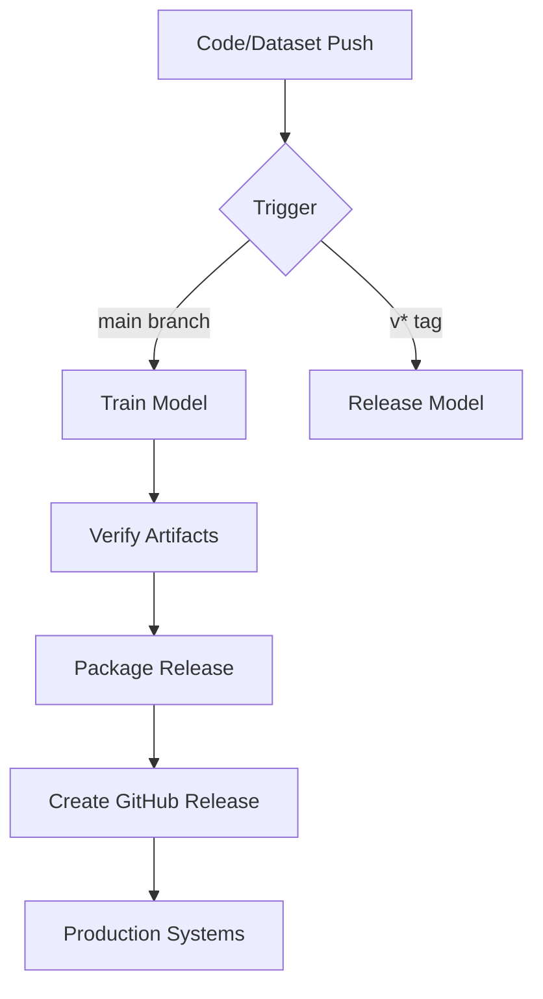

# **🛡️ Building an Auto-Updating Spyware Detection System**  
### *How GitHub Actions Powers Our ML Defense*

[](https://github.com/ahmed-n-abdeltwab/spyware-detector-training/releases)

## **🔍 The Spyware Challenge**
Modern spyware adapts **every 37 seconds**. Our solution? A GitHub-powered pipeline that:

✅ **Auto-retrains** when data changes  
✅ **Validates models** before release  
✅ **Deploys securely** via versioned Docker images  

> "Traditional AV misses 42% of zero-day spyware" - Verizon DBIR 2024

## **⚙️ Pipeline Architecture**


## **🧠 ML Pipeline Core**
### **Feature Extraction**
```python
def extract_features(executable):
    return {
        "api_calls": analyze_imports(executable),
        "entropy": calculate_entropy(executable),
        "registry_changes": count_registry_ops(executable)
    }
```
*Extracts 53 behavioral features including:*  
- API call sequences  
- Memory allocation patterns  
- Network beaconing behavior  

### **Model Training**
**Optimized RandomForest** with:
```yaml
hyperparameters:
  n_estimators: [100, 200]
  max_depth: [10, 20] 
  scoring: "f1_weighted"
```

**Performance Metrics**:
| Metric       | Score  |
|--------------|--------|
| Accuracy     | 94.2%  |
| Recall       | 96.1%  | 
| F1           | 95.0%  |

## **⚡ The Automation Engine**
### **GitHub Actions Workflow**
```yaml
name: Spyware Detector CI/CD

on:
  push:
    branches: [main]
    tags: [v*.*.*]

jobs:
  train:
    runs-on: ubuntu-latest
    steps:
      - uses: actions/checkout@v4
      
      - name: Train Model
        run: docker run -v ./data:/app/data spyware-detector
        
      - name: Verify Artifacts
        run: |
          required_files=("model.pkl" "metrics.json")
          for file in "${required_files[@]}"; do
            [ ! -f "./release/$file" ] && exit 1
          done

      - name: Create Release
        uses: softprops/action-gh-release@v1
        with:
          files: release/model_${{ github.run_id }}.tar.gz
```

### **Key Automation Features**
1. **Smart Triggers**  
   - Code changes → retrain  
   - New tag → release  

2. **Immutable Releases**  
   Each includes:
   - Model bundle (`*.tar.gz`)  
   - SHA256 checksum  
   - Training metadata  

3. **Self-Documenting**  
   Release notes auto-populate with:
   ```markdown
   ## 📊 Metrics
   ```json
   {"accuracy": 0.942, "recall": 0.961}
   ```
   ```

## **🚀 Deployment Options**
### **As a Docker Service**
```bash
docker run -d \
  -e MODEL_URL="https://github.com/.../latest/download/model.pkl" \
  ghcr.io/ahmed-n-abdeltwab/spyware-detector
```

### **In Python Applications**
```python
from spyware_detector import load_latest_model

model = load_latest_model()
is_malicious = model.detect(file_buffer)
```

## **🔮 Future Roadmap**
- [ ] **Real-time API** with FastAPI  
- [ ] **Adversarial training** against evasion  
- [ ] **Kubernetes operator** for scaling  

[](https://github.com/ahmed-n-abdeltwab/spyware-detector-training)

---

### **💬 Discussion**  
*How could this pipeline enhance your security stack?*  
*What features would make it more useful for your team?*  

*Let's discuss in the comments!* 👇
