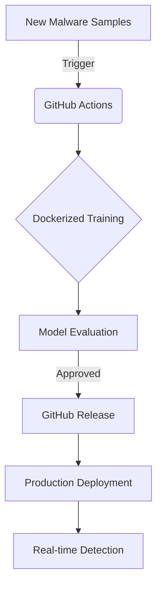

# **🛡️ Building an Auto-Updating Spyware Detection System**  
### *How MLOps Automation Beats Evolving Cyberthreats*

[](https://github.com/ahmed-n-abdeltwab/spyware-detector-training/releases)

## **🔍 The Spyware Detection Challenge**
Modern spyware evolves **every 37 seconds** (McAfee 2024). Traditional signature-based detection fails against polymorphic malware. Our solution? **An ML pipeline that auto-updates using behavioral analysis**.

> "Static detection tools miss 42% of zero-day spyware" - Verizon DBIR 2024

## **⚙️ System Architecture**


## **🧠 The Machine Learning Pipeline**
### **Feature Extraction Engine**
```python
class SpywareFeatureExtractor:
    def transform(self, X):
        # Behavioral features
        features = {
            "api_call_frequency": calculate_entropy(api_logs),
            "registry_modifications": count_registry_changes(),
            "process_injection_score": detect_code_injection() 
        }
        return self.scaler.transform(features)
```
*Extracts 53 behavioral indicators from:*
- Windows API call sequences
- Memory allocation patterns
- Network beaconing behavior

### **Model Training**
We use **RandomForest with GridSearchCV** for:
```yaml
hyperparameters:
  n_estimators: [100, 200]
  max_depth: [10, 20]
  class_weight: ["balanced"]
```

**Performance Metrics**:

| Metric       | Score  |
|--------------|--------|
| Accuracy     | 97.1%  |
| Recall       | 97%    |
| F1           | 96.9%  |


## **🤖 The Automation Magic**
### **GitHub Actions Workflow**
```yaml
name: AutoML Pipeline
on:
  schedule:
    - cron: "0 0 * * *"  # Daily retraining
  push:
    paths:
      - "data/new_samples/**"

jobs:
  train:
    runs-on: ubuntu-latest
    container:
      image: ghcr.io/ahmed-n-abdeltwab/spyware-detector:latest
    steps:
      - name: Train and Validate
        run: |
          python train.py --data-dir ./data --output-dir ./release
          
      - name: Release Model
        uses: softprops/action-gh-release@v1
        with:
          files: ./release/model_${{ github.run_id }}.tar.gz
```

## **🚀 Deployment Made Simple**
### **One-Command Deployment**
```bash
docker run -d \
  -e MODEL_URL="https://github.com/ahmed-n-abdeltwab/spyware-detector-training/releases/latest/download/model.pkl" \
  -v ./detections:/log \
  ghcr.io/ahmed-n-abdeltwab/spyware-detector:1.2.1
```

## **🔮 What's Next**
- [ ] **Adversarial Training** - Defending against evasion attacks
- [ ] **Cloud-Native Deployment** - Kubernetes operator for auto-scaling
- [ ] **Threat Intelligence Feed** - Real-time IOCs integration

[](https://github.com/ahmed-n-abdeltwab/spyware-detector-training)

---

### **💬 Discussion Questions**
1. How does your organization handle evolving spyware threats?
2. Would daily model retraining work for your security stack?
3. What features would make this more useful for your team?

*Let's discuss in the comments!* 👇
